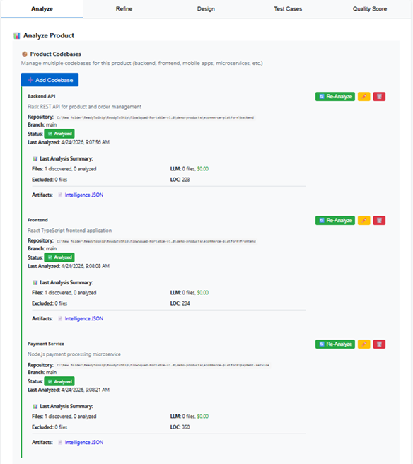
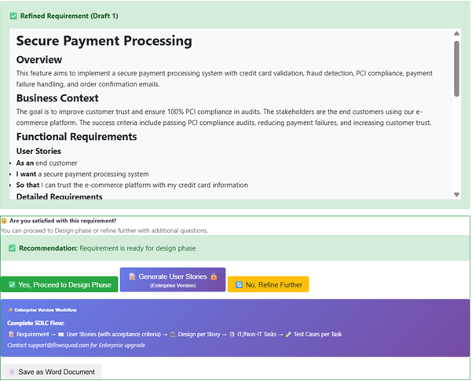
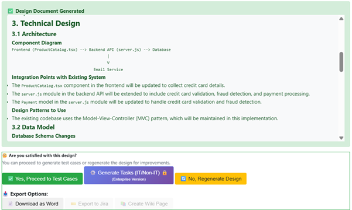
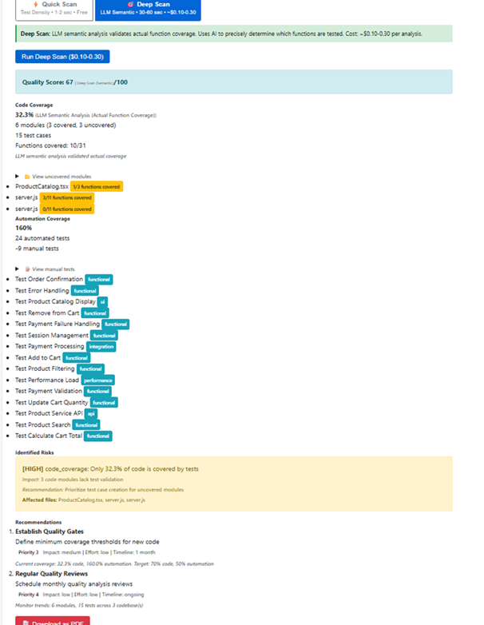

# FlowSquad

## From code to decisions

FlowSquad is an AI-powered platform that analyzes your codebase and transforms it into actionable insights for your engineering squad.

**Works with your existing repositories — no code changes, no setup complexity.**

---

## 📥 Download

👉 https://github.com/flowsquad-ai/flowsquad/releases

---

## 🎥 Demo

👉 https://youtu.be/M56-Kezxxio

---

## ❌ Why Traditional AI Falls Short

Most AI tools generate without context.

They don’t understand your architecture, patterns, or risks.  
The output looks correct — but doesn’t fit your system.

---

## ✅ What FlowSquad Does Differently

FlowSquad learns directly from your codebase.

It understands your services, dependencies, and structure —  
and generates outputs that actually align with your system.

---

## ⚡ From Code to Intelligence

FlowSquad transforms your codebase into:

### 📌 Requirements
- Refined, context-aware functional understanding  
- Eliminates ambiguity and back-and-forth  

### 🏗 Design
- Implementable architecture insights  
- API contracts, flow-level understanding  

### 🧪 Testing
- Suggested test scenarios  
- Coverage gaps identification  

### 📊 Quality
- Semantic code analysis  
- Risk and complexity indicators  

### ⏱ Estimation
- Effort and impact analysis  
- Better sprint planning decisions  

---

## 📸 Product Preview

### Code → Context → Intelligence

### Context-Aware Requirements

### Implementable Designs

### Semantic Quality & Coverage

---

## 🐳 Deployment Options

FlowSquad can be used in multiple ways:

### 💻 Local (Windows)
- Portable EXE  
- No installation required  
- Ideal for individual users  

### 🐳 Containerized (Docker)
- Run on Linux servers  
- Suitable for teams and internal deployments  
- Easy to deploy and scale  

Works seamlessly in both environments.

---

## 🚀 Features

- AI-powered codebase analysis  
- Context-aware requirement generation  
- Design insights aligned with your architecture  
- Test case suggestions  
- Semantic quality and coverage analysis  
- Effort estimation and risk detection  
- Docker-based deployment for team and enterprise environments  

---

## ⚙️ How to Use

### Option 1: Windows (Recommended for Quick Start)

1. Download the ZIP file  
2. Extract contents  
3. Run `FlowSquad-Setup.exe`  
4. Add your preferred AI API key  
5. Provide repository path or URL  
6. Start analysis  

---

### Option 2: Docker (Linux / Teams)

1. Pull the FlowSquad Docker image  
2. Run the container  
3. Access via browser (http://localhost:5000)  
4. Complete setup and start analysis  

*(Detailed Docker instructions available in USER_GUIDE.md)*

---

## 🧪 Evaluation Version

This is an early evaluation version.

Note:
- Application is not code-signed yet  
- Windows may show a security warning  
- Click “More info” → “Run anyway” to proceed  

---

## 🎯 What Teams Gain

- Faster delivery  
- Higher quality  
- Fewer production surprises  

---

## 📧 Support

support@flowsquad.ai

---

## 🚀 Final Thought

Don’t generate code. Generate intelligence.

Your codebase already holds the answers.  
FlowSquad turns it into intelligent context — so requirements align, designs match reality, and you know what’s actually tested.
