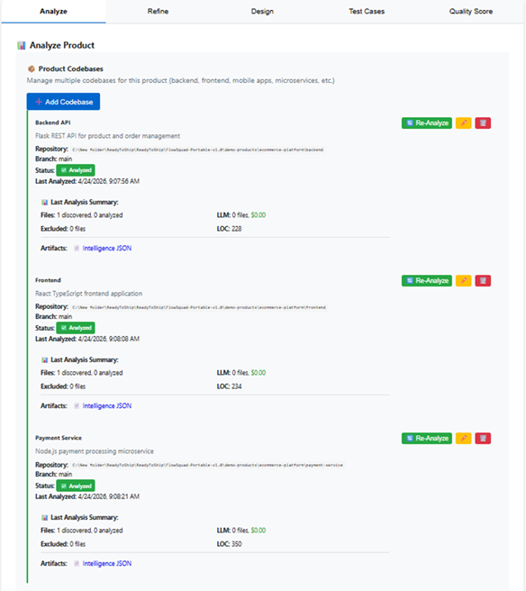
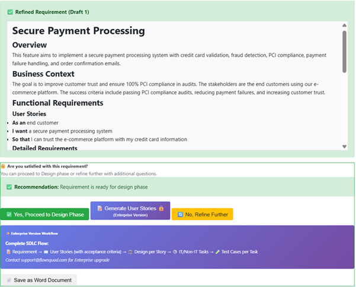
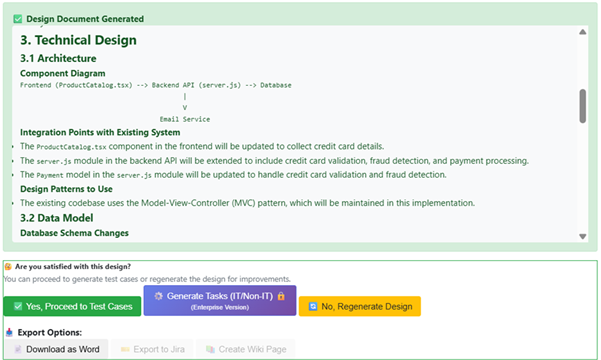
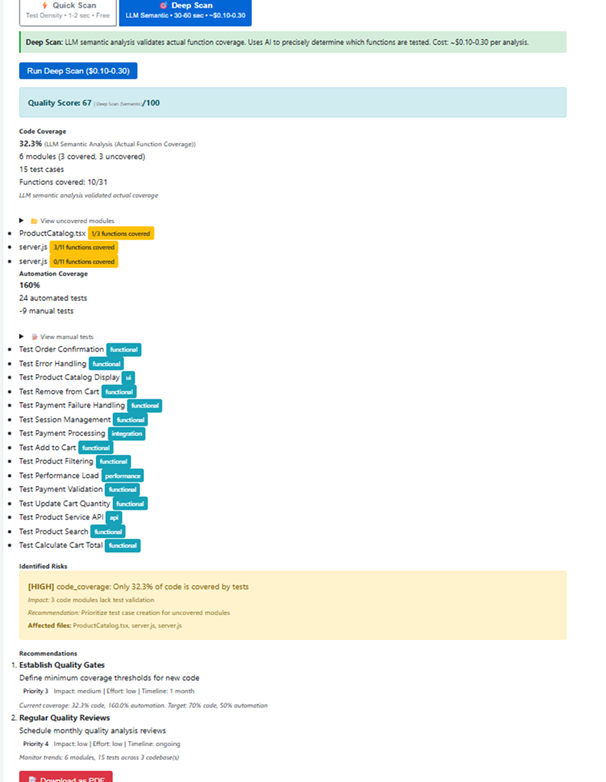

# FlowSquad

**Your codebase already knows the answers. FlowSquad surfaces them.**

Stop explaining your system to AI tools that don't understand it. FlowSquad reads your codebase once, builds deep product intelligence, and generates requirements, designs, and test cases that actually fit your architecture.

> **One analysis. Infinite artifacts. Zero repeated LLM cost.**

🌐 [flowsquad.ai](https://flowsquad.ai) &nbsp;·&nbsp; 📘 [Documentation](https://flowsquad.ai/docs) &nbsp;·&nbsp; 📧 [support@flowsquad.ai](mailto:support@flowsquad.ai)

---

## 📥 Download v2.0

| Platform | Package |
|---|---|
| 💻 Windows Portable | [FlowSquad-Win-Portable-v2.0.zip](https://github.com/flowsquad-ai/Flowsquad/releases/download/v2.0/FlowSquad-Win-Portable-v2.0.zip) |
| 🪟 Windows Installer | [FlowSquad-Win-Installer-v2.0.zip](https://github.com/flowsquad-ai/Flowsquad/releases/download/v2.0/FlowSquad-Win-Installer-v2.0.zip) |
| 🐧 Linux Standalone | [FlowSquad-Linux-Standalone-v2.0.tar.gz](https://github.com/flowsquad-ai/Flowsquad/releases/download/v2.0/FlowSquad-Linux-Standalone-v2.0.tar.gz) |
| 🐧 Linux Systemd | [FlowSquad-Linux-Systemd-v2.0.tar.gz](https://github.com/flowsquad-ai/Flowsquad/releases/download/v2.0/FlowSquad-Linux-Systemd-v2.0.tar.gz) |
| 🐳 Docker | [FlowSquad-Docker-v2.0.zip](https://github.com/flowsquad-ai/Flowsquad/releases/download/v2.0/FlowSquad-Docker-v2.0.zip) |
| ☸️ Kubernetes Manifests | [FlowSquad-Kubernetes-v2.0.zip](https://github.com/flowsquad-ai/Flowsquad/releases/download/v2.0/FlowSquad-Kubernetes-v2.0.zip) |
| ☸️ Kubernetes Helm | [flowsquad-2.0.tgz](https://github.com/flowsquad-ai/Flowsquad/releases/download/v2.0/flowsquad-2.0.tgz) |

👉 [View full release notes](https://github.com/flowsquad-ai/Flowsquad/releases/tag/v2.0)

---

## 🎥 Demo

👉 https://youtu.be/M56-Kezxxio

---

## ⚡ Ten Purpose-Built Workflow Tabs

From a single codebase analysis, FlowSquad generates:

| # | Tab | What It Does |
|---|---|---|
| 1 | **Analyze** | Load from GitHub, GitLab, Bitbucket, Gitea, Azure DevOps, or local folder |
| 2 | **Refine** | AI requirement refinement with completeness scoring (0–100) |
| 3 | **Epic** | Generate structured epics — ready to push to Jira |
| 4 | **Story** | User stories with acceptance criteria aligned to your actual code |
| 5 | **Task** | Granular development tasks grounded in real code patterns |
| 6 | **Design** | Architecture diagrams, API contracts, data flow — auto-generated |
| 7 | **Test Cases** | Test scenarios matched to your existing frameworks (Pytest, Cypress, Selenium…) |
| 8 | **Quality Score** | Semantic code quality, complexity metrics, risk indicators |
| 9 | **Security Scan** | OWASP Top 10 analysis against your actual codebase |
| 10 | **AskProduct** | Natural language Q&A over your entire product knowledge base |

---

## 🏗 How It Works

```
Your Repository
      │
      ▼
  [Analyze] ── Parse code, extract modules, dependencies, patterns
      │
      ▼
  Vector Store ── Embeddings stored once, reused by all tabs
      │
      ├──▶ Refine / Epic / Story / Task
      ├──▶ Design
      ├──▶ Test Cases
      ├──▶ Quality Score / Security Scan
      └──▶ AskProduct
```

One analysis. Every artifact. No repeated LLM cost.

---

## 🤖 Supported AI Providers

| Provider | Notes |
|---|---|
| **OpenAI** | GPT-4, GPT-4o, GPT-4o-mini, GPT-4-turbo, GPT-3.5-turbo |
| **Anthropic Claude** | Via Anthropic API |
| **GitHub Models** | GPT-4o and GPT-4o-mini via GitHub marketplace |
| **Ollama** | Fully local, air-gapped — Enterprise tier |

Each product can be configured with a different provider per operation type.

---

## 🚀 Quick Start

### Windows (Portable — no install)
```
1. Download FlowSquad-Win-Portable-v2.0.zip
2. Extract to any folder
3. Run FlowSquad-Setup.exe
4. Open http://localhost:5000
5. Complete the Setup Wizard
```

### Linux Standalone (no root required)
```bash
tar -xzf FlowSquad-Linux-Standalone-v2.0.tar.gz
cd FlowSquad-Linux-Standalone-v2.0
chmod +x start-flowsquad.sh && ./start-flowsquad.sh
# Open http://localhost:5000
```

### Linux Systemd (production service)
```bash
tar -xzf FlowSquad-Linux-Systemd-v2.0.tar.gz
cd FlowSquad-Linux-Systemd-v2.0
sudo ./install.sh
# FlowSquad starts automatically — open http://localhost:5000
```

### Docker
```bash
unzip FlowSquad-Docker-v2.0.zip
cd FlowSquad-Docker-Protected-v2.0
chmod +x deploy.sh && ./deploy.sh
# Open http://localhost:5000
```

### Kubernetes (Helm)
```bash
helm install flowsquad flowsquad-2.0.tgz \
  --namespace flowsquad --create-namespace \
  -f values.yaml
```

---

## 🔌 Integrations

**Project Management:** Jira (push Epics, Stories, Tasks, Designs)

**Documentation:** Confluence (import pages, publish designs)

**Source Control:** GitHub · GitLab · Bitbucket · Azure DevOps · Gitea

**Identity & SSO:** LDAP/Active Directory · SAML 2.0 · OAuth2
(Okta, Azure AD, Keycloak, OneLogin, ADFS, Google, Microsoft)

---

## 🏢 Evaluation vs Enterprise

| | Evaluation | Enterprise |
|---|---|---|
| License | 30-day free | Contact us |
| Products | 1 | Unlimited |
| Workflow tabs | All 10 | All 10 |
| Deployment | Windows, Linux, Docker, K8s | All + air-gapped |
| RBAC | — | Global Admin / Product Admin / Member |
| SSO | — | LDAP, SAML 2.0, OAuth2 |
| MFA | — | TOTP + email OTP |
| Jira / Confluence | — | ✓ |
| PostgreSQL / MySQL | — | ✓ |
| Ollama (air-gapped) | — | ✓ |
| Field encryption | — | Fernet AES-128-CBC |
| Audit logs | — | Immutable |
| Compliance | — | SOC 2 / HIPAA / GDPR |
| Support | Community | Priority |

---

## 🔒 Security & Privacy

- **Your code never leaves your machine** — all analysis runs locally
- **No cloud uploads required** — works fully offline with Ollama (Enterprise)
- **Field-level encryption** — API keys and credentials encrypted at rest
- **Immutable audit logs** — every action recorded for compliance
- **MFA + SSO** — TOTP, email OTP, LDAP, SAML 2.0, OAuth2 (Enterprise)

> Windows binaries are not yet code-signed. Windows Defender SmartScreen will show a warning on first run — click **More info → Run anyway** to proceed.

---

## 📸 Product Preview

### Code → Context → Intelligence


### Context-Aware Requirements


### Implementable Designs


### Semantic Quality & Coverage


---

## 📘 Documentation

Full documentation at **[flowsquad.ai/docs](https://flowsquad.ai/docs)**:

- [Installation Guide](https://flowsquad.ai/docs/install-guide) — Windows, Linux, Docker, Kubernetes
- [Setup Guide](https://flowsquad.ai/docs/setup-guide) — complete the Setup Wizard
- [Admin Guide](https://flowsquad.ai/docs/admin-guide) — products, users, licensing
- [User Guide](https://flowsquad.ai/docs/user-guide) — all 10 workflow tabs
- [Integration Guide](https://flowsquad.ai/docs/integration-guide) — Jira, Confluence, SSO, SCM
- [Security Reference](https://flowsquad.ai/docs/security-guide) — TLS, encryption, RBAC, compliance

---

## 📧 Support

[support@flowsquad.ai](mailto:support@flowsquad.ai)

---

*Your codebase already holds the answers. FlowSquad turns it into intelligent context — so requirements align, designs match reality, and you know what's actually tested.*
